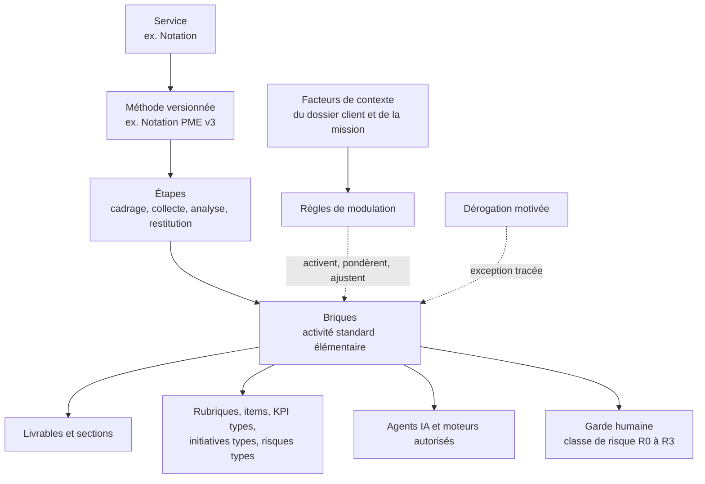

# PRD complémentaire — MissionPilot, le cabinet d'expertise augmenté

8 octobre 2026 · proposition du Pilote, à valider par le commanditaire

Ce document **complète** le [PRD principal](<PRD — MissionPilot, logiciel de planification stratégique.md>) du 6 octobre 2026 ; il ne le remplace pas. Il reprend le cahier « Plateforme SANKORIA — Prototype des 5 services IA-Consulting » (01/10/2025), le prolonge et en corrige les angles morts. Les identifiants d'exigences du PRD principal restent valables ; ce document ajoute des familles nouvelles (STD, DOS, PRV, AGT, AUT, QUA, AO, CAP, CLI) et prolonge la numérotation des services (NOT-09 et suivants, DD-09…, PLA-12…, KPI-13…, RED-10…). Tant qu'il n'est pas validé, le PRD principal fait foi en cas de désaccord.

## 1. En une page

**Ambition.** Faire de MissionPilot le système d'exploitation du cabinet d'expertise : un cabinet de 15 personnes y produit avec la rigueur, la vitesse et la mémoire d'un grand cabinet international, sans perdre la finesse du terrain africain.

**Formule.** *L'IA fait 80 % de la production, l'expert 100 % du jugement.* SANKORIA visait 60 % d'IA et 40 % d'expertise ; on vise plus haut sur la production (collecte, analyse, rédaction, relances, reporting) et on garde l'humain entier sur ce qui engage : conclusions, chiffres publiés, recommandations, signature.

**Trois leviers, et la condition qui les rend sûrs.**

| Levier | Ce que cela change pour le cabinet |
| --- | --- |
| **IA maximale** | Une équipe d'agents spécialisés (collecte, documents, entretiens, analyse, rédaction, contradiction, qualité, PMO) prépare chaque étape ; le consultant relit, tranche et signe. |
| **Automatisation avancée** | Ce qui se fait deux fois devient une automatisation : de l'appel d'offres à la clôture, la mission avance seule entre les décisions humaines. |
| **Standardisation maximale** | Une seule grammaire pour toutes les missions : méthodes, briques, rubriques, preuves, livrables. La subtilité n'est pas sacrifiée : elle est **portée par des facteurs de contexte et des règles de modulation explicites**, et chaque exception est motivée, tracée et réinjectée dans le standard. |
| **La condition** | Chaque affirmation livrée au client a une preuve ; chaque chiffre sort d'un moteur testé ou d'une donnée sourcée ; l'autonomie de l'IA se mérite par la mesure et se retire au premier incident. |

**Ce que ce document ajoute** : le référentiel de méthodes (section 4), le dossier client vivant (5), le registre des preuves (6), l'équipe d'agents IA et leurs niveaux d'autonomie (7), le moteur d'automatisation (8), les appels d'offres (9), la qualité professionnelle industrialisée (10), les cinq services augmentés et quatre services candidats (11), la capitalisation et l'observatoire (12), l'expérience client (13).

**Ce qui ne change pas** (AGENTS.md, DECISIONS.md) : isolation stricte entre cabinets (RLS), données financières internes réservées, budget figé à la signature, périodes de temps verrouillées, interface en français, IA via OpenRouter avec repli sans clé, « l'IA propose, l'expert dispose ».

## 2. SANKORIA, et ce qu'on y ajoute

Le cahier SANKORIA pose les bonnes intuitions. Il laisse quatre questions ouvertes : comment **mesurer** la part de l'IA, comment **garantir** qu'une conclusion est fondée, comment **rester cohérent** d'un consultant à l'autre, et comment **apprendre** d'une mission à la suivante. Ce PRD y répond.

| Idée du cahier SANKORIA | Limite | Ce que MissionPilot ajoute |
| --- | --- | --- |
| 60 % d'IA, 40 % d'expertise | Proportion affirmée, jamais mesurée | Contribution de l'IA mesurée sur chaque livrable (AGT-05) ; autonomie par brique, promue ou retirée selon les résultats (AGT-03) |
| Triangulation questionnaires + entretiens + observations | Principe qualitatif | Registre des preuves : chaque assertion relie ses sources, pour et contre ; indice de solidité calculé (PRV-02) |
| Personnalisation selon secteur, pays, taille, culture | Laissée au prompt, donc invisible et non reproductible | Facteurs de contexte typés et règles de modulation déterministes, simulables et journalisées (STD-04, STD-05) |
| Questionnaires adaptatifs générés par l'IA | Questions potentiellement différentes à chaque fois, scores non comparables | Banque d'items standard étalonnée ; l'IA choisit et reformule dans la banque, n'invente pas d'item non validé (NOT-09) |
| Scoring par dimension | Pas de mesure de fiabilité ni de cohérence entre évaluateurs | Rubriques à ancrages par niveau, indice de confiance de la note, calibration entre évaluateurs (NOT-11, NOT-13) |
| Base de connaissances alimentée par les experts | Effort manuel, base pauvre au lancement | Capitalisation automatique à chaque clôture, amorçage depuis les livrables historiques du cabinet, observatoire inter-cabinets anonymisé (CAP) |
| Cinq services décrits séparément | Silos : on ressaisit le client à chaque service | Dossier client vivant partagé par tous les services et toutes les missions (DOS) |
| Plan stratégique relié aux KPI | Lien décrit, boucle non fermée | Chaîne recommandation → initiative → KPI → effet mesuré → re-notation ; l'efficacité des recommandations est apprise par contexte (CAP-03) |
| Rapports générés | Livrable statique, qualité dépendante du relecteur | Livrables interactifs sourcés, revue guidée par les zones fragiles, quatre yeux sur ce qui engage (QUA) |
| Redressement inspiré de l'ONUDI | Sans outils de crise opérationnels | Trésorerie à 13 semaines, registre des créanciers, repères des procédures préventives OHADA (RED-11 à RED-13) |
| (absent) | Rien sur la vie du cabinet lui-même | Automatisation de bout en bout du cabinet et module d'appels d'offres, première source de revenus des cabinets africains (AUT, AO) |

## 3. Principes de conception

1. **Standard d'abord, contexte ensuite, exception en dernier.** Toute mission démarre d'une méthode standard ; le contexte la module par des règles explicites ; l'exception reste possible, motivée et tracée.
2. **L'IA produit, le moteur calcule, l'expert juge et signe.** Le modèle de langage rédige, classe, extrait, résume et critique ; il ne produit jamais un chiffre publié.
3. **Aucune affirmation sans preuve.** Ce qui part chez le client est sourcé, ou signé comme avis d'expert.
4. **L'autonomie de l'IA se mérite, se mesure et se retire.**
5. **Ce qui se fait deux fois devient une automatisation**, dans les mêmes droits et circuits d'approbation qu'un humain.
6. **Chaque mission rend le système plus intelligent** : temps réels, retours d'expérience, efficacité des recommandations.
7. **Le client est acteur, pas destinataire** : il dépose, répond, vote, valide et suit, depuis son téléphone.
8. **Pensé pour l'Afrique francophone** : connexion faible, WhatsApp, oralité et langues locales, informalité, OHADA et SYSCOHADA, bailleurs de fonds, paiement Mobile Money.

## 4. La clé de voûte : le référentiel de méthodes

La standardisation tient en une idée : **toutes les missions, de tous les métiers, parlent la même grammaire.** Ce qui varie d'une mission à l'autre est de la donnée de paramétrage, jamais du code ni un document Word recopié.

### 4.1 Méta-modèle

La **brique** est l'unité de standardisation. Elle décrit une activité qu'un cabinet répète d'une mission à l'autre :

| Attribut de la brique | Exemple : « Analyse des écarts de perception » |
| --- | --- |
| Objet | Comparer les réponses des dirigeants, des managers et des équipes sur chaque pratique |
| Entrées (contrat de données) | Réponses au questionnaire par population ; au moins 3 répondants par population |
| Moteur | Calcul des écarts par item et par dimension, seuil de significativité |
| Agent IA | Rédaction des constats et hypothèses d'explication, à partir des seuls écarts calculés |
| Classe de risque et garde | R2 : validation du consultant, relecture du chef de mission |
| Sortie | Section « Écarts de perception » du rapport de notation, graphique, assertions candidates au registre des preuves |
| Définition de terminé | Chaque écart > seuil commenté ; aucune hypothèse sans preuve ou mention « à vérifier en entretien » |
| Temps type | 0,5 j consultant senior (ajusté par l'historique réel, CAP-02) |
| Niveau d'autonomie IA maximal | N2 (brouillon automatique, validation obligatoire) |

### 4.2 Héritage à quatre niveaux

| Niveau | Propriétaire | Contenu | Règle |
| --- | --- | --- | --- |
| Standard MissionPilot | ACC (comité méthode) | Méthodes, briques, banques d'items, rubriques, KPI, initiatives, risques, gabarits, automatisations | Versionné ; mis à jour avec notes de version |
| Variante cabinet | Expert métier du cabinet | Ajouts, pondérations, gabarits à sa charte, ses propres méthodes | Hérite du standard ; les différences restent visibles |
| Variante de contexte | Règles de modulation | Ajustements selon secteur, pays, taille, propriété, fiabilité des données… | Déterministe, testée, simulable |
| Mission | Chef ou directeur de mission | Dérogation ponctuelle | Motif obligatoire, approbation selon la classe de risque, analysée ensuite (CAP-05) |

Une mission est **figée sur une version** de méthode : une évolution du standard ne modifie jamais en silence une mission en cours.

### 4.3 Facteurs de contexte : là où vivent les subtilités

Les subtilités du terrain deviennent des variables typées, renseignées dans le dossier client (section 5), que les règles savent lire.

| Facteur | Valeurs (exemples) | Effet typique |
| --- | --- | --- |
| Secteur et filière | CITI rév. 4, puis filière (cacao, anacarde, BTP, banque, télécoms…) | Pondérations, KPI et initiatives types, benchmarks de référence |
| Pays et zone | UEMOA, CEMAC, hors zone franc | Fiscalité, droit OHADA, jours fériés, devise et risque de change |
| Taille | Effectif, chiffre d'affaires, définition nationale de la PME | Questionnaire court ou complet, atelier unique au lieu d'entretiens |
| Propriété et gouvernance | Familiale, État actionnaire, filiale de groupe, coopérative, start-up financée | Module de gouvernance familiale, items de gouvernance publique, reporting au groupe |
| Fiabilité de l'information financière | Comptes certifiés, non certifiés, reconstitués | Analyses marquées « indicatives », reconstitution du chiffre d'affaires par les flux bancaires et Mobile Money |
| Part de l'informel et des espèces | Faible, moyenne, forte | Seuils d'alerte, contrôles de cohérence, prudence des conclusions |
| Exposition au commerce extérieur | Importations d'intrants, export, change | Risques de change et d'approvisionnement, scénarios du modèle financier |
| Saisonnalité | Campagne agricole, saison des pluies, fêtes | Lecture des KPI désaisonnalisée, BFR saisonnier |
| Langues des répondants | Français, anglais, dioula, wolof, bambara, lingala… | Questionnaire vocal traduit, validation de traduction par un locuteur |
| Culture managériale | Issue du questionnaire préliminaire des dirigeants (NOT-02) | Formulation des recommandations, conduite du changement proposée |
| Situation de l'entreprise | Croissance, stabilité, tension, difficulté | Bascule vers le pré-diagnostic de redressement (RED-01) |
| Financeur impliqué | Banque, bailleur, fonds | Formats imposés de livrables et de rapports d'impact |

### 4.4 Règles de modulation

Une règle est déclarative (« si le contexte vérifie… alors ajuster… »), testée sur des cas types, simulable avant activation et journalisée à chaque application. L'IA peut **proposer** une règle à partir des dérogations observées ; seul le comité méthode l'active.

Exemples :

- Si l'effectif est inférieur à 20 : questionnaire réduit aux items marqués essentiels ; entretiens remplacés par un atelier unique de 3 heures.
- Si la fiabilité des comptes est « non certifiés » et la part d'espèces « forte » : toute analyse financière est marquée « indicative » ; le modèle financier exige une reconstitution du chiffre d'affaires par les encaissements.
- Si l'actionnariat est familial : brique « Gouvernance familiale et succession » activée.
- Si l'État est actionnaire : items de gouvernance publique ; délais de paiement des créances publiques intégrés au BFR.
- Si la filière est agricole : KPI « pertes post-récolte » proposé ; lecture saisonnière des indicateurs.

Effets possibles d'une règle : activer ou retirer une brique ou un item, modifier une pondération ou un seuil, choisir un benchmark, un gabarit ou une formulation, proposer une recommandation candidate, relever la classe de risque d'un livrable.

### 4.5 Rubriques à ancrages et calibration

Chaque pratique évaluée a cinq niveaux décrits par des **comportements observables**, avec des exemples par contexte (« à quoi ressemble le niveau 3 en pilotage de la performance dans une PME agro-industrielle »). Deux consultants qui évaluent la même entreprise doivent arriver au même niveau : la calibration se mesure (NOT-13) et se corrige.

### 4.6 Exigences

| ID | Exigence | Priorité | Version |
| --- | --- | --- | --- |
| STD-01 | Méta-modèle unique (service, méthode, étape, brique, livrable, rubrique, item, KPI type, initiative type, risque type, gabarit, automatisation) commun à tous les services et métiers | Indispensable | V3 |
| STD-02 | Bibliothèques standard versionnées, propriété d'ACC, héritées par chaque cabinet | Indispensable | V3 |
| STD-03 | Héritage standard → cabinet → contexte → mission ; différences affichées ; mise à jour du standard proposée au cabinet avec notes de version et analyse d'impact | Indispensable | V3 |
| STD-04 | Facteurs de contexte typés, portés par le dossier client et la mission | Indispensable | V3 |
| STD-05 | Règles de modulation déclaratives et déterministes : tests sur cas types, simulation avant activation, journal d'application | Indispensable | V3 |
| STD-06 | Notes de contexte qualitatives rattachables à tout élément standard (pays, filière, usage local) | Important | V3 |
| STD-07 | Dérogations : motif obligatoire, approbation selon la classe de risque, traçabilité, tableau de bord des dérogations | Indispensable | V3 |
| STD-08 | Mission figée sur une version de méthode ; migration assistée et facultative vers une version plus récente | Indispensable | V3 |
| STD-09 | Rubriques à ancrages comportementaux par niveau, avec exemples par contexte | Indispensable | V3 |
| STD-10 | Dictionnaire de données et taxonomies partagés : secteurs (CITI rév. 4), pays, tailles, fonctions, processus, KPI, risques | Indispensable | V3 |
| STD-11 | Éditeur de méthodes sans code pour les experts métier, avec aperçu de la mission générée et contrôle de cohérence | Important | V3 |
| STD-12 | Comité méthode : circuit de proposition, revue et publication des évolutions du standard | Important | V3 |
| STD-13 | Amorçage : l'IA analyse les propositions et rapports historiques d'un cabinet et propose briques, gabarits et rubriques, validés par ses experts | Important | V3 |
| STD-14 | Place de marché des méthodes : un cabinet publie une méthode éprouvée, d'autres l'adoptent sous licence | Souhaitable | V5 |

## 5. Le dossier client vivant

Aujourd'hui, chaque service ressaisit l'entreprise. Demain, l'entreprise a **un dossier unique, daté et sourcé**, que la notation alimente, que le plan exploite, que le pilotage met à jour et que le redressement reprend. D'une mission à l'autre, d'une année à l'autre, le cabinet repart de ce qu'il sait.

| ID | Exigence | Priorité | Version |
| --- | --- | --- | --- |
| DOS-01 | Modèle unifié de l'entreprise cliente : profil, organisation, processus, produits et marchés, finances multi-exercices, KPI, risques, initiatives, notations, parties prenantes ; partagé par tous les services et missions du cabinet | Indispensable | V3 |
| DOS-02 | Faits datés et sourcés : valeur, date d'effet, source, fiabilité, auteur ; historique conservé | Indispensable | V3 |
| DOS-03 | Ingestion des états financiers (PDF, Excel, liasse SYSCOHADA) : extraction IA avec référence de page, contrôles d'équilibre par moteur (actif = passif, résultat cohérent) ; acceptation automatique si tous les contrôles passent, sinon revue | Indispensable | V3 |
| DOS-04 | Indice de fiabilité des données du client (certification, informalité, cohérence), qui module la confiance des analyses | Important | V3 |
| DOS-05 | Groupes et filiales : structure de détention, consolidation simple des indicateurs | Important | V4 |
| DOS-06 | Frise chronologique de l'entreprise : notations, missions, décisions, alertes | Important | V3 |
| DOS-07 | Export du dossier à la demande du client (portabilité, loi n° 2013-450 et RGPD) | Important | V3 |

**Précision de règle, à acter dans DECISIONS.md.** Un chiffre **extrait** d'un document client par l'IA n'est pas un chiffre **produit** par l'IA : c'est une donnée sourcée (document, page), qui ne sert aux calculs qu'après contrôles déterministes réussis ou confirmation humaine. Les moteurs restent seuls à calculer.

## 6. Registre des preuves

Le registre des preuves rend la triangulation de SANKORIA mesurable. Une **preuve** est un élément observé (réponse, verbatim d'entretien, observation de terrain, extrait de document, donnée externe) ; une **assertion** est une conclusion qu'on veut écrire dans un livrable.

| Objet | Contenu |
| --- | --- |
| Preuve | Type de source, source précise, date, auteur, fiabilité (A à D), lien vers l'extrait |
| Assertion | Énoncé, rattachement (dimension, hypothèse, risque), preuves pour et contre, indice de solidité, statut |

**Indice de solidité** (calculé par moteur, valeurs à calibrer au pilote) : pour chaque type de source indépendant (questionnaire, entretien, observation, document, donnée externe), on retient la meilleure fiabilité (A = 1 ; B = 0,75 ; C = 0,5 ; D = 0,25) ; on somme, on plafonne à 2, on divise par 2. Une contradiction non résolue divise l'indice par deux. Lecture : **solide** ≥ 0,75 (au moins deux sources indépendantes fiables), **étayée** de 0,5 à 0,75, **fragile** en dessous.

| ID | Exigence | Priorité | Version |
| --- | --- | --- | --- |
| PRV-01 | Preuves typées et sourcées, rattachées au dossier client et à la mission | Indispensable | V3 |
| PRV-02 | Assertions reliées à leurs preuves pour et contre ; indice de solidité calculé par moteur | Indispensable | V3 |
| PRV-03 | Toute assertion d'un livrable de classe R2 ou R3 est rattachée à une preuve, ou marquée « avis d'expert » et signée | Indispensable | V3 |
| PRV-04 | Détection des contradictions entre preuves (agent contradicteur), à arbitrer par le consultant | Indispensable | V3 |
| PRV-05 | Carte de triangulation : sources × dimensions, zones non couvertes signalées avant l'analyse | Important | V3 |
| PRV-06 | Citations cliquables dans les livrables web ; annexe des sources dans les exports PDF et Word | Important | V3 |

## 7. L'équipe IA : agents spécialisés

L'orchestrateur IA existant (garde des chiffres, masquage, plafond de coût, validation) devient le socle d'une **équipe d'agents** aux rôles bornés. Chaque agent a une mission, des entrées, des outils autorisés, un format de sortie validé par schéma, une garde humaine et un niveau d'autonomie maximal. Un agent agit toujours **dans les droits de l'utilisateur qui le déclenche** (ou d'un compte d'automatisation aux droits restreints) : la sécurité au niveau des lignes s'applique à lui comme à tous.

| Agent | Fait | Ne fait jamais |
| --- | --- | --- |
| Avant-vente | Lit l'appel d'offres ou le besoin, extrait les exigences, propose méthode, équipe et planning, rédige l'offre technique | Fixer un prix (moteur de tarification) |
| Cadrage | Prépare la lettre de mission, la liste de demandes documentaires, le plan de collecte, la réunion de lancement | Signer ou envoyer sans validation |
| Collecte | Assemble les questionnaires depuis la banque d'items, traduit, relance, contrôle la complétude | Inventer un item hors banque validée |
| Documentaire | Classe les documents reçus, extrait les données avec référence de page, signale les incohérences | Accepter un chiffre qui échoue aux contrôles |
| Entretien | Prépare le guide, transcrit, code les verbatims par dimension, propose des assertions | Publier un verbatim nominatif sans accord |
| Terrain | Transforme notes vocales et photos en observations structurées rattachées aux dimensions | Noter une pratique |
| Analyste | SWOT, causes racines, hypothèses, synthèse par dimension, à partir du registre des preuves | Conclure sans preuve |
| Contradicteur | Cherche contre-preuves, incohérences, biais, affirmations non sourcées | Modifier le livrable |
| Rédacteur | Rédige livrables et présentations au gabarit et au ton du cabinet | Écrire un chiffre non fourni par un moteur |
| Qualité | Vérifie la définition de terminé, la traçabilité des chiffres et des preuves, le style ; prépare la revue | Valider à la place du relecteur |
| PMO | Suit planning, jalons, actions ; prépare comités et rapports d'avancement | Décaler un jalon contractuel |
| Veille | Surveille sources sectorielles, réglementaires et appels d'offres | Citer une source non vérifiable |
| Capitalisation | À la clôture, rédige le retour d'expérience, anonymise, met à jour les bases | Partager une donnée identifiante |
| Copilote | Interface conversationnelle unique : répond, route vers les agents, déclenche des actions confirmées | Agir hors des droits de l'utilisateur |

### 7.1 Niveaux d'autonomie

| Niveau | Comportement | Exemple |
| --- | --- | --- |
| N0 | Pas d'IA | Signature de la lettre de mission |
| N1 | Suggestion à la demande | Reformuler un paragraphe |
| N2 | Brouillon automatique, validation obligatoire avant tout usage | Section d'analyse d'un rapport |
| N3 | Exécution automatique interne, contrôle par échantillonnage | Classement des documents reçus, codage des verbatims |
| N4 | Exécution automatique y compris vers le client | Relance d'un questionnaire, accusé de réception d'un document |

Règles proposées : N4 est réservé aux briques de classe R0 (ni conclusion, ni chiffre). Une brique passe de N2 à N3 après au moins 50 exécutions, au moins 95 % acceptées sans modification majeure et aucun incident majeur sur 90 jours, **sur décision d'un associé**. Le premier incident majeur la fait redescendre automatiquement.

### 7.2 Exigences

| ID | Exigence | Priorité | Version |
| --- | --- | --- | --- |
| AGT-01 | Registre des agents : mission, entrées, outils, droits, briques couvertes, niveau d'autonomie maximal | Indispensable | V3 |
| AGT-02 | Sorties structurées validées par schéma ; chiffres uniquement issus des moteurs ou de données sourcées (garde existante étendue) | Indispensable | V3 |
| AGT-03 | Niveaux d'autonomie N0 à N4 par brique et par cabinet ; promotion sur décision humaine, rétrogradation automatique sur incident | Indispensable | V3 |
| AGT-04 | Jeux d'essai de référence par brique ; tout changement de prompt ou de modèle passe une évaluation de non-régression avant activation | Indispensable | V3 |
| AGT-05 | Contribution de l'IA mesurée par livrable : part du brouillon conservée après validation (distance d'édition) et temps expert passé | Indispensable | V3 |
| AGT-06 | Routage des modèles par tâche (coût, qualité, latence), cache, plafond de coût par mission et par cabinet | Indispensable | V3 |
| AGT-07 | Documents, réponses et messages des clients traités comme **données non fiables** : aucune instruction qu'ils contiennent n'est suivie, aucune action n'est déclenchée par leur contenu | Indispensable | V3 |
| AGT-08 | Copilote conversationnel unique, dans les droits de l'utilisateur ; toute action modifiante est confirmée | Important | V3 |
| AGT-09 | Transparence de chaque sortie : sources, version de prompt, modèle, coût, niveau d'autonomie | Indispensable | V3 |
| AGT-10 | Mode dégradé sans IA : gabarits déterministes signalés comme tels (existant, étendu à toutes les briques) | Indispensable | V3 |
| AGT-11 | Transcription et compréhension de la voix (notes de terrain, entretiens, réponses vocales), langues locales prioritaires du marché | Important | V4 |

## 8. Automatisation des processus

### 8.1 Moteur d'automatisation

Un catalogue d'**événements métier** (proposition acceptée, mission signée, document reçu, questionnaire clos, feuille validée, jalon atteint, facture échue, KPI au rouge…) déclenche des **règles** (déclencheur → conditions → actions). Les actions passent par les mêmes droits, séparations des tâches et circuits d'approbation qu'un humain. Un cabinet active les automatisations standard, les simule sur ses données passées, puis les ajuste.

### 8.2 Bibliothèque d'automatisations standard

| Déclencheur | Actions automatiques | Décision humaine qui reste |
| --- | --- | --- |
| Appel d'offres détecté et pertinent | Fiche go/no-go, équipe proposée, rétro-planning de réponse | Go ou no-go |
| Proposition acceptée | Mission créée depuis la méthode, lettre de mission en brouillon, liste de demandes documentaires, ordre du jour de lancement | Signature |
| Mission signée | Planning et staffing proposés, invitations au portail, questionnaires préparés | Validation du staffing et des envois |
| Document reçu dans la salle de mission | Classement, extraction, mise à jour de la liste de demandes, contrôles | Revue des extractions en échec |
| Questionnaire sans réponse | Relances J+3 et J+7 (existant), message WhatsApp à J+10, alerte au chef de mission | Relance personnelle |
| Collecte complète (seuil atteint) | Calcul de la notation, brouillons d'analyse, revue de cohérence par l'agent contradicteur | Analyse et arbitrages |
| Feuille de temps non soumise le vendredi | Rappel, feuille pré-remplie ; relance le lundi | — |
| Atterrissage au-delà du budget de 5 % | Alerte, note d'analyse de l'écart, scénarios (réallocation, avenant) | Choix du scénario |
| Jalon atteint | Facture en brouillon selon l'échéancier, circuit d'approbation | Approbation |
| Facture échue | Relances graduées J+15, J+30 ; alerte associé à J+45 | Escalade |
| KPI au rouge deux périodes de suite | Note d'alerte, action corrective proposée, offre de diagnostic flash au client | Envoi de l'offre |
| Clôture demandée | Check-list bloquante, bilan, retour d'expérience, enquête de satisfaction | Clôture |
| 6 et 12 mois après la clôture | Questionnaire de suivi, mise à jour du dossier, opportunité détectée | Démarche commerciale |

### 8.3 Exigences

| ID | Exigence | Priorité | Version |
| --- | --- | --- | --- |
| AUT-01 | Catalogue d'événements métier publié par chaque module | Indispensable | V3 |
| AUT-02 | Règles déclencheur → conditions → actions paramétrables sans code | Indispensable | V3 |
| AUT-03 | Bibliothèque d'automatisations standard activables par cabinet (tableau 8.2) | Indispensable | V3 |
| AUT-04 | Simulation d'une automatisation sur les données passées avant activation | Important | V3 |
| AUT-05 | Les actions respectent droits, séparation des tâches et circuits d'approbation ; aucun contenu R2 ou R3 n'est envoyé au client sans validation | Indispensable | V3 |
| AUT-06 | Journal des exécutions, annulation quand c'est possible, coupe-circuit par cabinet et par automatisation | Indispensable | V3 |
| AUT-07 | Brief quotidien par rôle : ce qui attend une décision, ce qui dérive, ce qui est prêt à envoyer | Important | V3 |
| AUT-08 | Check-list de clôture standard et bloquante, paramétrable (temps validés, débours traités, factures émises, livrables signés, capitalisation faite) | Indispensable | V3 |
| AUT-09 | Pré-remplissage des temps depuis les affectations, l'agenda et l'activité sur la plateforme, à confirmer par le consultant | Important | V3 |
| AUT-10 | Rapport d'avancement hebdomadaire au client, généré et validé par le chef de mission | Important | V3 |
| AUT-11 | Optimisation du staffing par solveur déterministe (compétences, charge, coût, continuité client), arbitrée par le responsable des ressources | Important | V4 |
| AUT-12 | Prévision de chiffre d'affaires et de charge du cabinet (carnet signé et pipeline pondéré) | Important | V3 |

AUT-08 traite aussi un écart relevé par la recette du 7 octobre 2026 : la clôture d'une mission n'exige aujourd'hui que son statut et un droit (scénario E2E, annexe D).

## 9. Développement commercial : appels d'offres et propositions

Pour beaucoup de cabinets d'Afrique francophone, les appels d'offres publics et des bailleurs (Banque mondiale, Banque africaine de développement, Union européenne, agences de coopération) sont la première source de missions. Répondre coûte des jours de seniors, souvent dans l'urgence. C'est le terrain où l'automatisation rapporte le plus vite.

| ID | Exigence | Priorité | Version |
| --- | --- | --- | --- |
| AO-01 | Veille multi-sources des appels d'offres et rapprochement avec les compétences, références et secteurs du cabinet | Important | V3 |
| AO-02 | Score go/no-go déterministe (adéquation, références, charge, marge estimée, concurrence connue), décision de l'associé | Indispensable | V3 |
| AO-03 | Extraction des exigences du dossier d'appel d'offres et matrice de conformité suivie jusqu'au dépôt | Indispensable | V3 |
| AO-04 | Banque de CV structurés ; mise au format exigé par chaque bailleur ; contrôle des années d'expérience et des diplômes requis | Indispensable | V3 |
| AO-05 | Banque de références et d'attestations de bonne exécution, recherche par secteur, pays, bailleur et montant | Indispensable | V3 |
| AO-06 | Offre technique rédigée depuis la méthode standard et le contexte (compréhension des termes de référence, méthodologie, planning, organisation) | Indispensable | V3 |
| AO-07 | Offre financière par moteur : jours par expert, taux, per diem, débours, devise, taxes | Indispensable | V3 |
| AO-08 | Rétro-planning de réponse, tâches assignées, alertes avant la date limite | Important | V3 |
| AO-09 | Groupements et sous-traitants : partenaires, répartition des rôles et des honoraires | Important | V4 |
| AO-10 | Analyse des résultats (gagné, perdu, prix et score du lauréat) alimentant le score go/no-go et la politique de prix | Important | V4 |

## 10. Qualité et responsabilité professionnelle

Plus l'IA produit, plus la revue humaine doit être exigeante : le risque principal n'est plus l'erreur de l'IA, c'est **le relecteur qui valide sans lire**. La qualité est donc conçue comme un parcours, pas comme un bouton. Le dispositif s'aligne sur les bonnes pratiques reconnues des services de conseil et de la gestion de la qualité des cabinets (lignes directrices ISO 20700, norme ISQM 1 pour les cabinets d'audit), sans en reproduire le texte ; l'alignement exact est à confirmer par un expert.

| Classe | Nature | Garde |
| --- | --- | --- |
| R0 | Opérationnel interne (relance, rappel, classement) | Automatique, journalisé |
| R1 | Analyse interne (brouillons, notes de travail) | Validation de l'auteur |
| R2 | Livrable client | Validation du consultant et relecture du chef de mission |
| R3 | Engageant : chiffres financiers, notation publiée, recommandation d'investissement, plan de redressement | R2, plus revue d'un second expert (quatre yeux) et signature du directeur de mission |

| ID | Exigence | Priorité | Version |
| --- | --- | --- | --- |
| QUA-01 | Classe de risque R0 à R3 portée par chaque brique et chaque livrable, avec la garde associée | Indispensable | V3 |
| QUA-02 | Définition de terminé par livrable, vérifiée par l'agent qualité avant la revue humaine | Indispensable | V3 |
| QUA-03 | Revue guidée : le relecteur parcourt d'abord les assertions fragiles, les chiffres et les recommandations ; validation impossible sans ce parcours ; temps de revue mesuré | Indispensable | V3 |
| QUA-04 | Quatre yeux et signature pour la classe R3 | Indispensable | V3 |
| QUA-05 | Revue à froid par échantillonnage des missions clôturées ; constats et plan d'amélioration | Important | V4 |
| QUA-06 | Livrable signé : signataire, qualité, version, empreinte ; mention de la contribution de l'IA selon la politique du cabinet | Indispensable | V3 |
| QUA-07 | Acceptation de mission : vérification des conflits d'intérêts (même groupe, investisseur et cible, concurrents) et profil de risque du client | Important | V3 |
| QUA-08 | Satisfaction du client à chaque jalon et à la clôture (NPS), visible de l'associé | Important | V3 |

## 11. Les services de conseil, version augmentée

Les exigences du PRD principal (NOT-01 à 08, DD-01 à 08, PLA-01 à 11, KPI-01 à 12, RED-01 à 09) restent valables. Celles qui suivent les prolongent.

### 11.1 Notation (service #1)

La note devient **fiable, explicable, comparable et vivante**.

| ID | Exigence | Priorité | Version |
| --- | --- | --- | --- |
| NOT-09 | Banque d'items standard étalonnée (dimension, pratique, échelle, ancrages, formulations par public) ; questionnaire adaptatif contrôlé : l'IA sélectionne et reformule dans la banque selon des règles, pour un temps de réponse réduit | Indispensable | V3 |
| NOT-10 | Écarts de perception entre dirigeants, managers, équipes et parties externes, signalés comme constats | Indispensable | V3 |
| NOT-11 | Indice de confiance affiché avec la note (couverture des items, nombre de répondants, solidité des preuves) ; publication impossible sous un seuil | Indispensable | V3 |
| NOT-12 | Explicabilité : contribution de chaque pratique à la note ; simulateur « que faut-il pour passer de C à B », calculé par moteur | Indispensable | V3 |
| NOT-13 | Calibration entre évaluateurs : double cotation d'un échantillon, écart mesuré, sessions de calibrage | Important | V3 |
| NOT-14 | Positionnement en percentile face à l'observatoire (secteur, pays, taille) dès que l'échantillon le permet (CAP-04) | Important | V4 |
| NOT-15 | Attestation de notation vérifiable par un tiers (banque, investisseur) par lien ou code, avec date de validité et révocation | Important | V4 |
| NOT-16 | Tendance entre deux notations : KPI et avancement des initiatives alimentent un indicateur de tendance, sans nouvelle note publiée sans revue | Souhaitable | V4 |
| NOT-17 | Plan d'action construit depuis la bibliothèque d'initiatives, priorisé par l'impact observé dans des contextes semblables et la capacité du client | Important | V3 |

### 11.2 Due diligence (service #2)

La due diligence devient **une démarche par hypothèses**, où chaque verdict est sourcé.

| ID | Exigence | Priorité | Version |
| --- | --- | --- | --- |
| DD-09 | Arbre d'hypothèses d'investissement : hypothèse → analyses → preuves → verdict (confirmée, infirmée, non concluante) | Indispensable | V4 |
| DD-10 | Lecture IA de la salle de données du vendeur : classement, extraction, incohérences entre documents (chiffre d'affaires déclaré, comptable et fiscal), questions au management générées | Indispensable | V4 |
| DD-11 | Bibliothèque de signaux d'alerte par secteur et pays, maintenue par les experts | Indispensable | V4 |
| DD-12 | Moteur de dimensionnement de marché (descendant et ascendant), paramètres sourcés, fourchette et sensibilité | Important | V4 |
| DD-13 | Note au comité d'investissement au format standard, en version exécutive ou détaillée depuis la même base (prolonge DD-08) | Indispensable | V4 |
| DD-14 | Filtrage environnemental et social selon des cadres publics (ex. normes de performance de la SFI) et la liste d'exclusion de l'investisseur | Important | V4 |
| DD-15 | Plan des 100 jours après l'opération, relié aux services #3 et #4 | Important | V4 |

### 11.3 Planification stratégique et modèle financier (service #3)

Le plan devient **un graphe vivant**, de la vision jusqu'à l'indicateur, re-prévu chaque trimestre.

| ID | Exigence | Priorité | Version |
| --- | --- | --- | --- |
| PLA-12 | Cascade stratégique en graphe : vision → objectifs → initiatives → projets → jalons → KPI, chaque nœud avec un porteur ; trous signalés (objectif sans KPI, initiative sans porteur) | Indispensable | V3 |
| PLA-13 | Bibliothèque d'initiatives types : prérequis, coût et durée types, risques, efficacité observée par contexte | Indispensable | V3 |
| PLA-14 | Priorisation du portefeuille : score valeur, effort et risque ; optimisation sous contraintes de budget et de capacité proposée par moteur ; arbitrage humain | Important | V3 |
| PLA-15 | Ateliers stratégiques en ligne intégrés au parcours (vote, priorisation, matrices), synthèse IA | Important | V3 |
| PLA-16 | Simulation de Monte-Carlo sur les hypothèses clés, reproductible (graine fixée) : distribution de la VAN et probabilité de tension de trésorerie | Important | V4 |
| PLA-17 | Bancabilité : ratios (couverture du service de la dette, endettement, BFR en jours), plan de financement, dossier bancaire généré | Important | V3 |
| PLA-18 | Plan vivant : re-prévision trimestrielle depuis les réalisés ; écarts plan et réel expliqués | Important | V4 |

### 11.4 Pilotage des KPI (service #4)

Le tableau de bord devient **un rituel de décision**, alimenté jusque depuis WhatsApp.

| ID | Exigence | Priorité | Version |
| --- | --- | --- | --- |
| KPI-13 | Arbres d'indicateurs : décomposition d'un KPI en leviers, contributions calculées par moteur | Important | V3 |
| KPI-14 | Saisie et alertes par WhatsApp (texte ou vocal), avec confirmation et contrôle de vraisemblance | Important | V4 |
| KPI-15 | Score de qualité des données par KPI : fraîcheur, complétude, cohérence | Important | V3 |
| KPI-16 | Prévision statistique déterministe (tendance, saisonnalité) avec intervalle ; l'IA commente, ne prévoit pas | Important | V4 |
| KPI-17 | Revue de performance ritualisée : ordre du jour, dossier et présentation générés ; décisions et actions suivies jusqu'à clôture | Indispensable | V3 |
| KPI-18 | Registre des actions correctives relié aux alertes, avec efficacité mesurée sur le KPI | Important | V3 |

### 11.5 Redressement (service #5)

Le redressement s'équipe **des outils de crise** que les praticiens utilisent réellement.

| ID | Exigence | Priorité | Version |
| --- | --- | --- | --- |
| RED-10 | Score d'alerte précoce déterministe (ratios, tendances, incidents de paiement) paramétré par secteur ; seuils fixés par les experts | Indispensable | V4 |
| RED-11 | Trésorerie à 13 semaines, prévision et réalisé chaque semaine | Indispensable | V4 |
| RED-12 | Registre des créanciers et suivi des négociations (échéanciers, accords, conditions) | Indispensable | V4 |
| RED-13 | Repères des procédures préventives OHADA (conciliation, règlement préventif) : jalons et pièces, contenu validé par un juriste, sans conseil juridique automatisé | Important | V4 |
| RED-14 | Bibliothèque de leviers de redressement avec impact chiffré type (BFR, coûts fixes, prix, cessions) | Important | V4 |
| RED-15 | Tableau de bord de transformation partagé, en lecture restreinte, avec le conseil d'administration et les banques | Important | V4 |

### 11.6 Services candidats

Le référentiel de méthodes permet d'ajouter un service sans développement spécifique, par assemblage de briques. Quatre candidats, à prioriser par le commanditaire :

| Service | Pourquoi | Briques réutilisées |
| --- | --- | --- |
| **Diagnostic flash** (5 jours, prix fixe) | Porte d'entrée commerciale ; réponse au bouton « mission flash » (KPI-10) et au pré-diagnostic (RED-01) | Questionnaire court, documentaire, analyse, rapport court |
| **Business plan bancable et recherche de financement** | Demande forte des PME ; débouché naturel de la notation et du plan | Modèle financier, bancabilité (PLA-17), dossier bancaire, veille des guichets |
| **Gouvernance, risques et contrôle interne** | Cœur de métier des cabinets d'audit ; exigé par banques et bailleurs | Cartographie des risques, matrice de contrôles, tests, plan de remédiation |
| **Impact et ESG** | Exigé par les bailleurs et les fonds d'impact | Indicateurs d'impact, collecte terrain, rapport au format du financeur |

## 12. Capitalisation et observatoire

Le cabinet qui utilise MissionPilot depuis trois ans doit être **mesurablement meilleur** que celui qui commence : estimations plus justes, recommandations plus efficaces, benchmarks plus riches.

| ID | Exigence | Priorité | Version |
| --- | --- | --- | --- |
| CAP-01 | Retour d'expérience généré à la clôture (contexte, méthode, écarts, leçons), validé par le chef de mission, versé à la base de connaissances | Indispensable | V3 |
| CAP-02 | Base d'estimation : temps réels par brique et par contexte, utilisés par l'estimation des propositions (prolonge MIS-06) | Indispensable | V3 |
| CAP-03 | Efficacité des recommandations : initiative recommandée → mise en œuvre → effet mesuré sur les KPI → score d'efficacité par contexte | Important | V4 |
| CAP-04 | Observatoire inter-cabinets sur adhésion : agrégats calculés par moteur, au moins 5 entreprises issues d'au moins 3 cabinets par case, aucune donnée brute partagée | Important | V4 |
| CAP-05 | Analyse des dérogations : les plus fréquentes deviennent des propositions d'évolution du standard au comité méthode | Important | V3 |
| CAP-06 | Matrice de compétences des collaborateurs mise à jour depuis les missions et les revues ; alimente le staffing et les CV | Important | V3 |
| CAP-07 | Recherche unifiée (missions, livrables, preuves, connaissances, références), dans les droits de l'utilisateur | Important | V3 |

## 13. Expérience client et collaboration

| ID | Exigence | Priorité | Version |
| --- | --- | --- | --- |
| CLI-01 | Salle de mission : liste de demandes documentaires suivie, dépôt par le client, accusé de réception, relances, statut par pièce | Indispensable | V3 |
| CLI-02 | Questionnaires accessibles par lien WhatsApp, hors ligne, et en version vocale dans les langues locales prioritaires | Important | V4 |
| CLI-03 | Ateliers en ligne avec le client (vote, priorisation, matrices) et synthèse IA validée | Important | V3 |
| CLI-04 | Livrables interactifs sur le portail : navigation, sources, commentaires du client, validation de jalon | Indispensable | V3 |
| CLI-05 | Signature électronique des lettres de mission, avenants et procès-verbaux de validation (prolonge MIS-08) | Important | V4 |
| CLI-06 | Assistant du client, limité à ce que le cabinet lui a partagé : questions sur ses rapports, KPI et actions | Souhaitable | V4 |
| CLI-07 | Synthèse hebdomadaire du dirigeant sur mobile et par WhatsApp : KPI, alertes, décisions attendues | Important | V4 |

## 14. Indicateurs de succès complémentaires

Ils s'ajoutent à ceux du PRD principal. Les cibles sont des propositions à valider au pilote.

| Objectif | Indicateur | Cible proposée |
| --- | --- | --- |
| Répondre plus vite | Offre technique prête à relire après réception d'un appel d'offres | ≤ 4 heures |
| Livrer plus vite | Rapport de notation après la fin de la collecte | ≤ 2 jours ouvrés (PRD principal : 5) |
| Livrer plus vite | Plan stratégique chiffré | ≤ 3 semaines (PRD principal : 4) |
| IA maximale | Contribution mesurée de l'IA aux livrables de production (AGT-05) | ≥ 75 % (PRD principal : 60 %) |
| Fiabilité | Assertions R2 et R3 rattachées à une preuve ou signées comme avis d'expert | 100 % |
| Standardisation | Écart entre évaluateurs sur les items doublement cotés (échelle de 1 à 5) | ≤ 0,5 point sur 90 % des items |
| Santé du standard | Part des briques ayant fait l'objet d'une dérogation | Entre 5 et 20 % : au-dessus, le standard est inadapté ; en dessous, il est peut-être contourné |
| Automatisation | Temps administratif par consultant (temps, relances, reporting) | − 50 % entre le début et la fin du pilote |
| Apprentissage | Missions clôturées avec retour d'expérience capitalisé | ≥ 90 % |
| Impact client | Initiatives recommandées suivies d'un KPI renseigné à 6 mois | ≥ 50 % |
| Commerce | Taux de succès aux appels d'offres | + 30 % relatif sur 12 mois |
| Sécurité | Incident IA majeur parvenu à un client | 0 |
| Coût | Coût IA d'une mission rapporté à son prix | ≤ 5 % (inchangé) |

## 15. Parcours cibles

**A. De l'appel d'offres à la mission en 48 heures**

1. Lundi, la veille repère un appel d'offres de la Banque africaine de développement sur la restructuration d'une société d'État ; score go/no-go 78/100, deux références comparables, charge compatible.
2. L'associé dit « go ». Dans l'heure, la matrice de conformité, l'équipe proposée, les CV au format du bailleur et le rétro-planning sont prêts.
3. Mardi, l'offre technique est rédigée depuis la méthode « Restructuration d'entreprise publique », modulée par le contexte (État actionnaire, secteur, pays) ; le moteur chiffre l'offre financière.
4. L'associé relit en revue guidée et signe. Quand le marché est gagné, la mission se crée depuis l'offre : découpage, budget, équipe, liste de demandes documentaires.

**B. Une notation en dix jours ouvrés**

1. Jour 1 : la mission est signée ; le client reçoit son accès, la liste de demandes et les questionnaires choisis dans la banque d'items selon sa taille et son secteur.
2. Jours 2 à 6 : les réponses arrivent, y compris vocales par WhatsApp ; l'agent documentaire extrait les états financiers et signale deux incohérences ; les entretiens sont transcrits et codés ; la carte de triangulation montre une dimension peu couverte, un entretien est ajouté.
3. Jour 7 : la collecte atteint son seuil ; le moteur calcule notes, écarts de perception et indice de confiance ; l'analyste rédige, le contradicteur conteste trois assertions.
4. Jours 8 et 9 : le consultant arbitre, la revue guidée passe par les zones fragiles, l'expert métier publie (règle NOT-07 inchangée).
5. Jour 10 : restitution en atelier en ligne ; le dirigeant vote ses priorités ; le plan d'action part dans le service #3, ses KPI dans le service #4.

**C. La boucle fermée**

1. Huit mois plus tard, le taux de service client est au rouge deux mois de suite.
2. La note d'alerte arrive au chef de mission avec l'action corrective de l'initiative liée et une offre de diagnostic flash ; le client l'accepte depuis son téléphone.
3. À la re-notation annuelle, l'évolution de chaque dimension est mesurée ; l'efficacité des initiatives menées est versée, anonymisée, à la base qui conseillera les prochaines entreprises semblables.

## 16. Exigences non fonctionnelles complémentaires

| Domaine | Exigence | Cible |
| --- | --- | --- |
| Traçabilité IA | Chaque exécution d'agent conserve entrées, sources, version de prompt, modèle, coût, sortie et décision humaine | 100 % des exécutions |
| Évaluation IA | Jeu d'essai de référence par brique, rejoué avant tout changement de prompt ou de modèle | 0 activation sans évaluation |
| Sécurité IA | Contenus clients isolés des instructions ; les agents n'ont que les outils de leur rôle | Tests d'injection en CI |
| Latence | Brouillon d'une section de rapport | ≤ 60 s, progression affichée |
| Coût | Plafond par mission et par cabinet, alerte à 80 % | Aucun dépassement silencieux |
| Observatoire | Seuils d'anonymat appliqués par moteur ; aucune donnée brute hors du cabinet | Tests d'anonymat en CI |
| Résidence des données | Hébergement et sous-traitants (IA, WhatsApp, transcription) déclarés ; transferts hors pays documentés | Registre ARTCI à jour |
| Conservation | Durées par type de donnée (générations IA, enregistrements d'entretiens, preuves), puis purge ou anonymisation | Politique validée par un juriste avant pilote |
| Réversibilité | Export complet d'un cabinet (données, méthodes, livrables) dans des formats ouverts | Sur demande, sous 30 jours |

## 17. Architecture : ce qui s'ajoute à l'existant

Le socle actuel suffit à porter ce PRD sans refonte : monorepo pnpm, Fastify, Next.js, PostgreSQL avec RLS, file `jobs`, moteurs purs de `packages/engines`, orchestrateur IA OpenRouter (ADR-001 à ADR-003).

| Composant | Évolution |
| --- | --- |
| Référentiel de méthodes | Nouveau schéma (méthodes, briques, règles, versions, dérogations) ; moteur de règles déterministe dans `packages/engines` |
| Agents | L'orchestrateur devient un exécuteur d'agents : registre, outils autorisés, schémas de sortie, niveaux d'autonomie, évaluations |
| Automatisation | Moteur d'événements et de règles sur la file `jobs` existante (exécution unique déjà garantie) |
| Moteurs | Nouveaux calculs testés : solidité des preuves, modulation, Monte-Carlo à graine fixée, solveur de staffing, prévisions, alerte précoce, dimensionnement de marché |
| Ingestion documentaire | Chaîne lecture, OCR et extraction dans un environnement isolé, prolongeant la détection de contenu actif des PDF |
| Recherche | pgvector et plein texte français (déjà prévu par DECISIONS.md) |
| Canaux | WhatsApp Business, transcription vocale, signature électronique : adaptateurs remplaçables |
| Observatoire | Schéma séparé ne contenant que des agrégats ; tâche d'anonymisation déterministe |

ADR à rédiger avant développement : référentiel de méthodes et héritage (ADR-004) ; exécuteur d'agents et niveaux d'autonomie (ADR-005) ; moteur d'automatisation (ADR-006) ; observatoire et anonymisation (ADR-007) ; canal WhatsApp (ADR-008) ; ingestion documentaire et OCR (ADR-009) ; signature électronique (ADR-010).

## 18. Feuille de route en vagues

L'ordre compte plus que les dates : le standard, le dossier client et les preuves sont les fondations de tout le reste.

| Vague | Contenu | Pourquoi maintenant | Condition de passage |
| --- | --- | --- | --- |
| 0 — Reliquats V2 | PLA-05, PLA-10, SOC-11, rédaction assistée par l'IA, rapports de notation et de plan en PDF et Word, saisie des KPI par le portail (HANDOFF) | Terminer ce qui est promis avant d'ajouter | Recette E2E réussie de bout en bout |
| 1 — Fondations (V3) | STD, DOS, PRV, AGT-01 à 05, QUA-01 à 04 ; méthode Notation migrée sur le référentiel | Tout le reste s'appuie dessus | La notation tourne sur le référentiel avec des résultats identiques à la V2 |
| 2 — Automatisation (V3) | AUT, copilote, brief quotidien, salle de mission, check-list de clôture | Gain de temps visible par tous dès le pilote | Temps administratif mesuré en baisse |
| 3 — Services augmentés et appels d'offres (V3) | NOT-09 à 13, PLA-12 à 15 et 17, KPI-13, 15, 17, 18, AO-01 à 08, CAP-01, 02, 05 à 07 | Valeur commerciale directe | Premier appel d'offres gagné avec la plateforme |
| 4 — Nouveaux services (V4) | Services #2 et #5 augmentés, services candidats retenus, voix et WhatsApp, signature électronique | Réutilisent les fondations | Une mission complète par service |
| 5 — Réseau (V5) | Observatoire, attestation vérifiable, place de marché des méthodes, connecteurs, marque blanche | Effet de réseau, qui exige plusieurs cabinets actifs | Au moins 10 cabinets adhérents |

## 19. Modèle économique : compléments

Hypothèses à tester auprès des cabinets pilotes, en plus des offres du PRD principal :

| Offre | Contenu | Logique |
| --- | --- | --- |
| Crédits IA | Quota inclus par consultant, consommation au-delà facturée au coût majoré | Protège la marge face aux usages intensifs |
| Module Appels d'offres | Veille, go/no-go, CV, offres techniques et financières | Payé par cabinet ; retour sur investissement dès le premier marché gagné |
| Bibliothèques sectorielles | Méthodes et banques d'items experts d'ACC par filière | Abonnement par bibliothèque |
| Observatoire | Gratuit pour les cabinets contributeurs ; payant pour les non-contributeurs et les investisseurs | Récompense la contribution |
| Attestation vérifiable | Vérification d'une notation par une banque ou un investisseur | Au cabinet émetteur ou au vérificateur |

## 20. Risques

| Risque | Impact | Parade |
| --- | --- | --- |
| Relecteurs qui valident sans lire (biais d'automatisation) | Erreur IA chez le client, responsabilité du cabinet engagée | Revue guidée obligatoire, temps de revue mesuré, quatre yeux en R3, revue à froid |
| Standard trop rigide | Consultants qui contournent l'outil | Facteurs de contexte, dérogations simples et motivées, indicateur de santé du standard |
| Standard trop lâche | Perte de comparabilité et d'apprentissage | Comité méthode, calibration, dictionnaire de données |
| Effort initial pour constituer le standard | Retard de la vague 1 | Amorçage par l'IA depuis les livrables historiques (STD-13) ; deux méthodes phares d'abord |
| Données clients peu fiables (informalité) | Conclusions fragiles | Indice de fiabilité, analyses marquées « indicatives », reconstitution par les flux |
| Fuite par l'observatoire | Perte de confiance des cabinets | Agrégats seuls, seuils d'anonymat testés, adhésion volontaire |
| Instructions cachées dans les documents des clients | Action non voulue d'un agent | AGT-07, outils bornés, actions confirmées |
| Dépendance au fournisseur d'IA et à ses prix | Marge érodée, service interrompu | OpenRouter multi-modèles, cache, plafonds, mode dégradé sans IA |
| WhatsApp : coût, politique de Meta, données hors infrastructure | Canal coupé ou cher | Adaptateur remplaçable, SMS en repli, données minimales dans les messages |
| Responsabilité professionnelle | Litige client | Signature humaine de tout livrable engageant, mention de la contribution IA, traçabilité complète |
| Adoption par les seniors | Usage limité aux juniors | Gains visibles (appels d'offres, brief quotidien), le senior décide et signe, l'IA prépare |

## 21. Décisions métier à prendre

Recommandation du Pilote entre parenthèses. Les décisions 1, 2, 3 et 5 ont été tranchées par le commanditaire le 8 octobre 2026 (reportées dans DECISIONS.md).

1. **Observatoire inter-cabinets** : **décidé** — adhésion volontaire, accès réservé aux contributeurs.
2. **Mention de la contribution IA** sur les livrables clients : **décidé** — au choix du cabinet, avec une mention par défaut dans le pied de page.
3. **Métiers couverts** : **décidé** — conseil en management et gouvernance, risques et contrôle interne ; audit légal et expertise comptable hors périmètre.
4. **Autonomie N4 vers les clients** : autorisée pour les relances et accusés de réception ? (Oui, classe R0 seulement, coupe-circuit par cabinet.)
5. **Priorité après les fondations** : **décidé** — le module d'appels d'offres passe avant les services #2 et #5.
6. **Services candidats** à retenir parmi les quatre de 11.6. (Diagnostic flash, puis business plan bancable.)
7. **Attestation de notation vérifiable** : ACC se porte-t-il garant de la méthode, et sous quelles conditions ? (Garant de la méthode, jamais de la note, qui reste signée par le cabinet.)
8. **WhatsApp Business** comme canal officiel, avec son coût par conversation et l'hébergement des messages chez Meta ? (Oui, avec données minimales et SMS en repli.)

## Annexe — Glossaire

| Terme | Sens |
| --- | --- |
| Brique | Activité standard élémentaire d'une méthode, avec entrées, moteur, agent, garde et sortie définis |
| Méthode | Enchaînement versionné d'étapes et de briques qui réalise un service |
| Facteur de contexte | Variable typée décrivant l'entreprise ou la mission (secteur, taille, propriété…) |
| Règle de modulation | Ajustement déterministe d'une méthode selon les facteurs de contexte |
| Dérogation | Écart motivé et tracé au standard, pour une mission donnée |
| Preuve | Élément observé et sourcé : réponse, verbatim, observation, extrait, donnée externe |
| Assertion | Conclusion destinée à un livrable, reliée à ses preuves |
| Indice de solidité | Mesure calculée de l'appui des preuves à une assertion |
| Classe de risque | Niveau d'engagement d'une sortie (R0 à R3), qui fixe la garde humaine |
| Niveau d'autonomie | Degré d'action de l'IA sur une brique (N0 à N4) |
| Dossier client vivant | Modèle unique, daté et sourcé de l'entreprise cliente, partagé par tous les services |
| Observatoire | Base d'agrégats anonymisés entre cabinets adhérents, pour le positionnement et les benchmarks |
